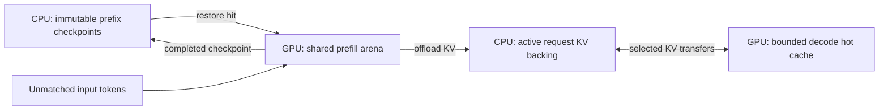

# Host prefix reuse

Qualified on the tested TP2 SM89/Qwen4Exp configuration. See
[the acceptance plan](PREFIX_CACHE_PLAN.md) and [results](PREFIX_CACHE_VALIDATION.md).

QSA HiSparse stores reusable prefixes in CPU memory. A hit copies the saved
state into the existing GPU prefill arena, computes only the unmatched suffix,
then uses the usual bounded sparse decode hot cache. Reading a CPU checkpoint
still costs PCIe transfer time; the benefit is avoiding the model's repeated
prefill computation.

Historical checkpoints do not keep the prefill arena or an active request slot.
Model weights and the existing fixed GPU allocations still remain resident.
Each active hit still reserves its complete logical/index pages and private
recurrent state. Caching does not enlarge the eight-request or 262,144-token
context limits, or remove the fixed GPU staging, index and Mamba allocations.

## Configuration

Use the `p2-offload` runtime and keep `--disable-radix-cache`. The specialized
host cache replaces the private chunk-cache scheduler; upstream GPU radix
sharing does not provide the required QSA ownership and recurrent state.

| Environment variable | Meaning |
| --- | --- |
| `SGLANG_QSA_HISPARSE_PREFIX_CACHE_MB` | CPU checkpoint budget in MiB **per TP rank**; `0` disables reuse |
| `SGLANG_QSA_HISPARSE_PREFIX_CACHE_MAX_ENTRIES` | Maximum retained checkpoints and pending writers per rank; default `256` |
| `SGLANG_QSA_HISPARSE_V3_EVENTS` | Optional directory for per-rank cache and runtime JSONL events |

A value of `8192` allows up to 16 GiB of checkpoint storage across TP2, in
addition to the existing active-request slabs and model/PLE host memory.
Checkpoints share immutable raw-KV/index segments where possible, but each
checkpoint has its own recurrent state. Sharing requires the exact cache entry
that the active request restored or published earlier; token equality alone
does not prove byte identity across independently computed chunk partitions.
If that entry was evicted, capture copies the active request's complete bytes.
Active requests retain only an entry ID, so eviction leaves no unaccounted
checkpoint tensor references. The byte budget covers unique tensor
storages and token keys; Python metadata and allocator overhead are additional.
Eviction skips referenced entries. A full budget can cause a cache miss; it
does not authorize exceeding the limit or changing the model computation.

## Saved state and boundaries

Each checkpoint contains exact FP8 K/V bytes, compressed index keys, pending
C4 keys and positions, every recurrent convolution and temporal state, and the
registered PLE convolution and n-gram histories. Missing or incompatible state
is rejected. Each continuation receives private mutable storage. Historical
prefixes own no request row, active lease, or GPU tensor.

Checkpoints are published only at completed, page64-aligned forward boundaries.
The scheduler splits an unaligned final prefill at its last complete page when
that produces a reusable checkpoint. A hit always leaves the required logits
tail to compute. Requests shorter than a page may receive no reuse, and two
prompts share only checkpoints actually captured before their first difference.
Input-logprob requests limit reuse to the positions whose probabilities need
not be recomputed.

This initial cache accepts ordinary text requests. Multimodal inputs, custom
position/embedding overrides, session or beam state, and hidden-state requests
bypass reuse. LoRA and ReplaySSM are rejected when enabling the cache. Cache
salt is part of identity; model mutation attempts invalidate the cache even
when the caller does not request an ordinary KV flush. A restart loses the
in-memory cache.

The API's `meta_info.cached_tokens` reports actual prefix reuse. Use fresh
`cache_salt` values for cold controls and the same value for shared prefixes.
For OpenAI-compatible responses, launch with `--enable-cache-report` to expose
`usage.prompt_tokens_details.cached_tokens` on hits. A cold ordinary text
request has `prompt_tokens_details: null` in the upstream usage serializer.
Health checks alone do not demonstrate a hit or numerical equivalence.

The deterministic comparison profile uses stable score selection in bounded
row tiles, with smaller-index ties and ascending selected indices. At compressed
score width 65,536, each sort handles four rows instead of the entire prefill
matrix. The tile sizing target is 16 MiB, not a hard allocator limit; input
scores, output indices and the width-sized column vector are additional.
The standalone 2,048-by-65,536 SM89 probe measured 20.63 MiB of extra allocation
including the 4 MiB output, and 0.103 seconds; see
[the qualification record](PREFIX_CACHE_VALIDATION.md). The initial FlashInfer graph-safe tie
selection failed on RTX 4090 because it requires 128 KiB of shared memory
while the target provides 100 KiB per SM; see the evidence in the acceptance
plan. Native inference retains its existing top-k collector.

For one-command lifecycle management, see [SERVICE.md](examples/qsa_hisparse/SERVICE.md).
