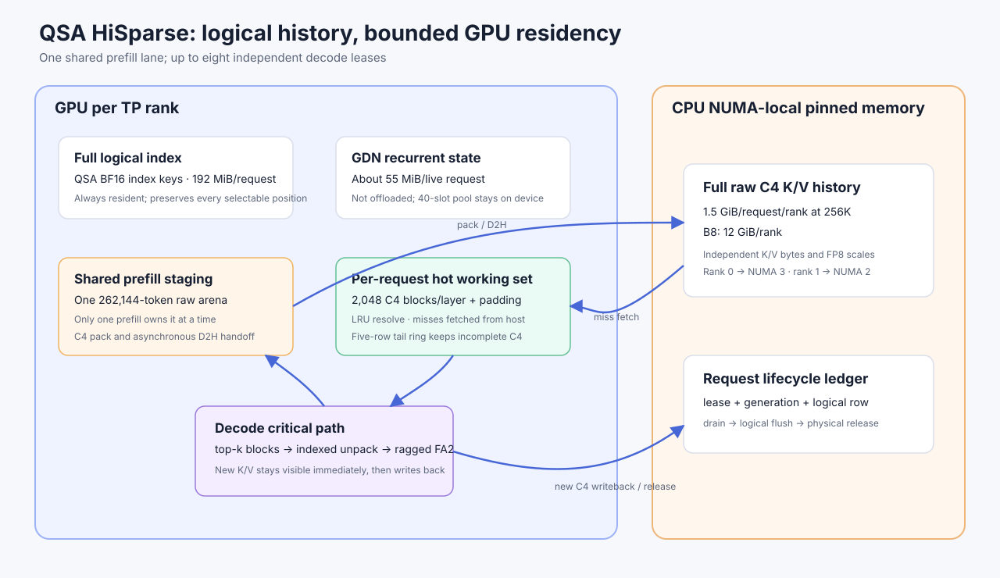
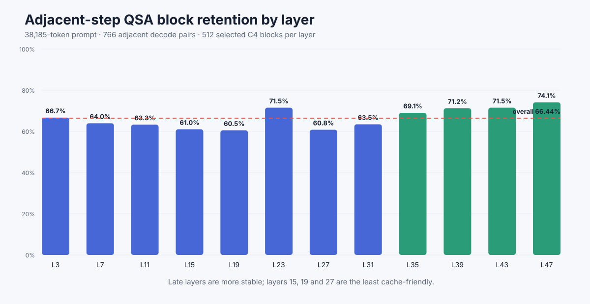
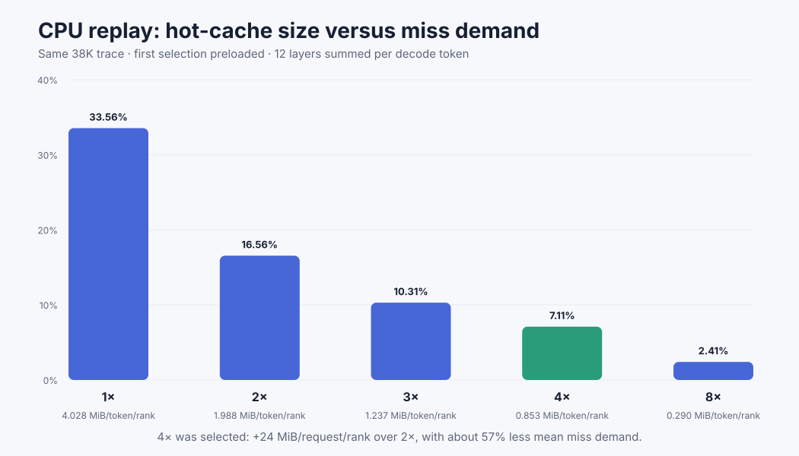
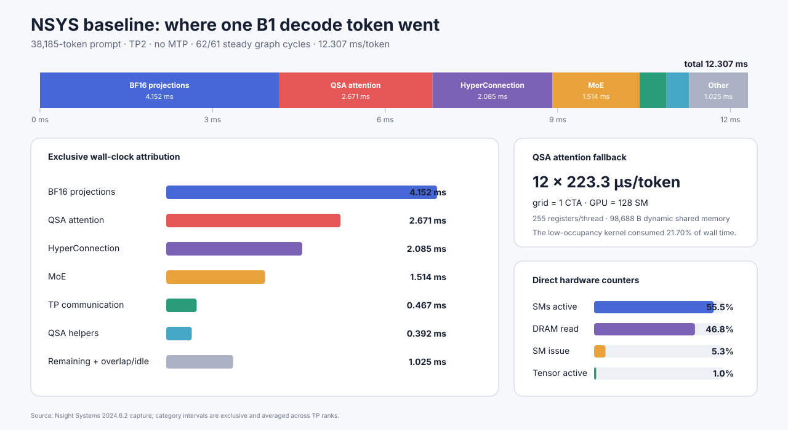
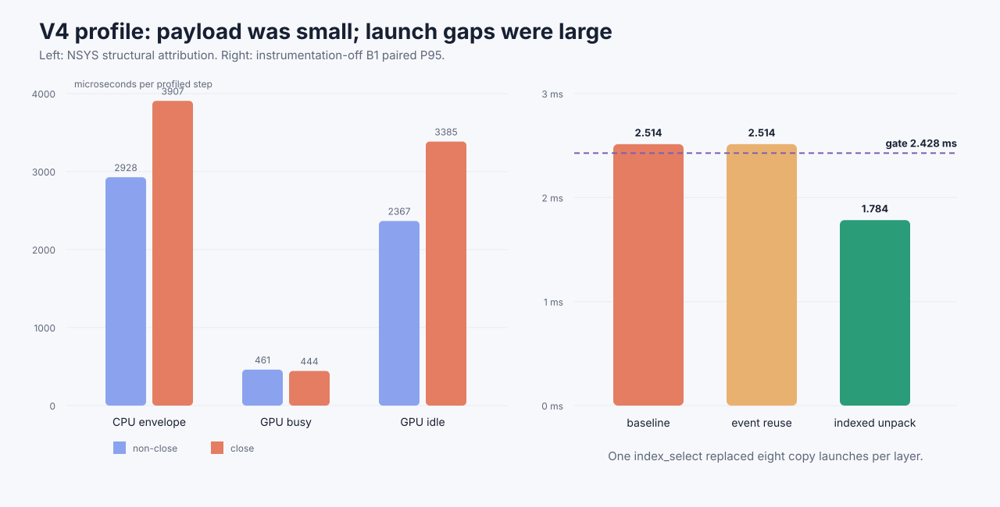
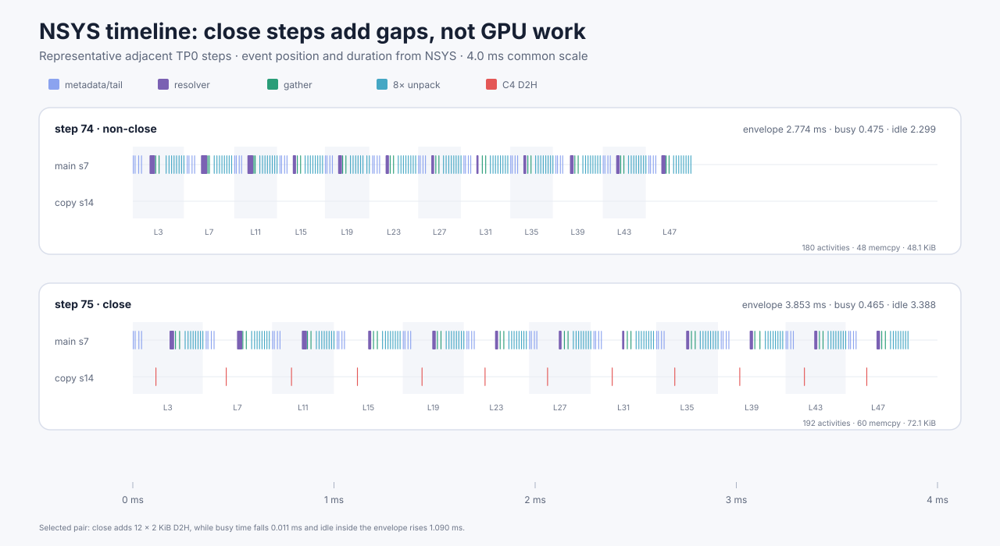
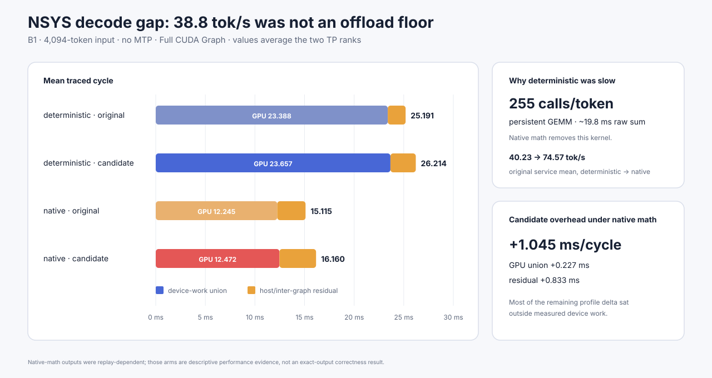
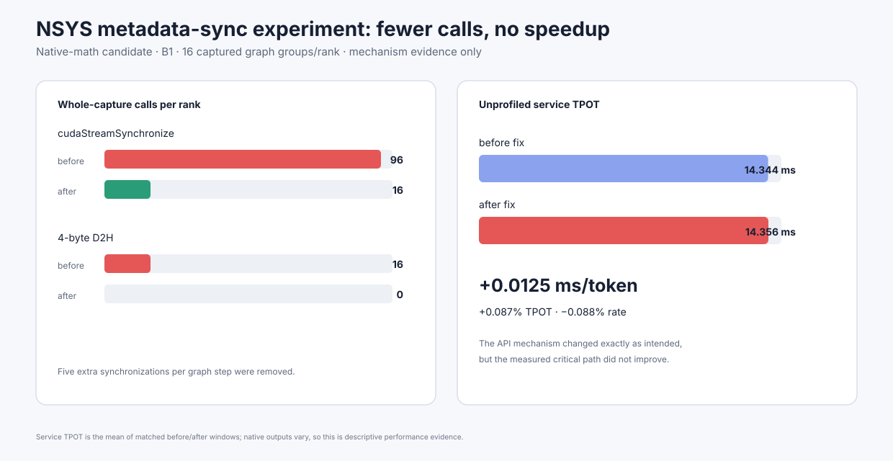
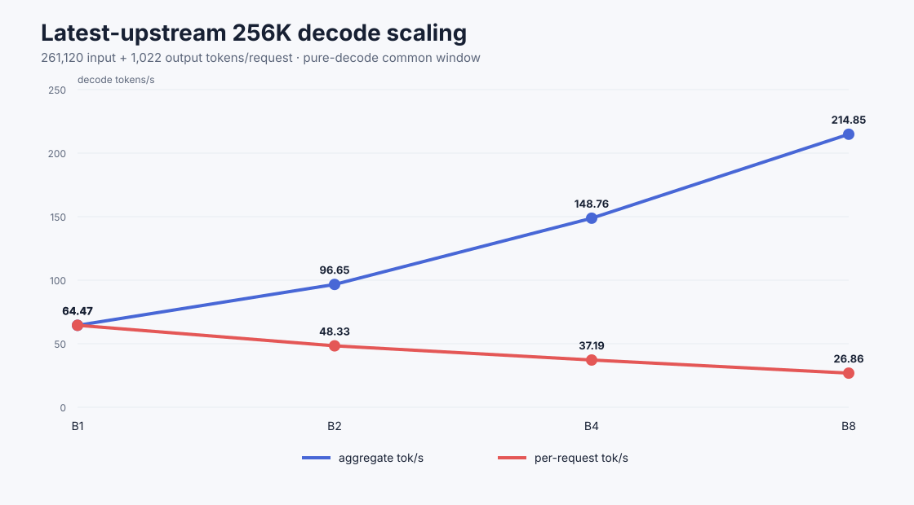

# 在双 RTX 4090 48GB 上把 HiSparse 移植到 QSA：从分层局部性到 8×256K 部署

稀疏注意力减少了每步真正读取的 KV，却不会自动减少必须保留的完整 KV 历史。对长上下文服务来说，这个差别决定了系统究竟是算力受限，还是先撞上显存容量墙。

目标是在一台双 RTX 4090 48GB 服务器上，把 SGLang 的 HiSparse 思路移植到 Qwen Sparse Attention（QSA），让同一个 TP2 实例能够承载 **8 条 256K 级长上下文请求**，同时保住可接受的 decode 性能和完整的请求生命周期。

改动和验证集中在五件事上：

1. 从真实 QSA decode 轨迹测出 12 个稀疏层的时间局部性，用 CPU 回放选择了 4× 热缓存，并证明 64-token 整页搬运在同等预算下过粗。
2. 将“完整逻辑历史”与“GPU 物理驻留”解耦：索引和 GDN 状态留在 GPU，完整 raw K/V 放入 NUMA 本地的 pinned host memory，GPU 只保留一个共享 prefill 暂存区和每个 decode 请求的固定热工作集。
3. 覆盖 B1/B2 eager 与 B1–B8 Full CUDA Graph 路径，补齐 lease、generation、尾部 C4、取消、复用和释放协议。
4. 通过 NSYS 和受控 A/B 找到并修复三类影响端到端结果的问题：多次 unpack launch、QSA eager/graph 的 score width 不一致，以及 TP2 下 AutoRound Marlin 被错误回退到 Triton。
5. 在最新上游基线上完成 8×256K 压测和部署验证。8 条请求全部完成 261,120-token prefill、1,022-token decode 和资源释放；最终源码还通过了 19-token 短请求与 2,048-token 边界请求。

先把结果和适用范围放在一起：

| 结果 | 测得数值 | 结论边界 |
| --- | ---: | --- |
| 8×256K 级容量 | 8/8 请求完成 | 证明准入、decode、完成和释放，不代表同时 GPU prefill |
| B8 纯 decode 公共窗口 | 214.85 tok/s aggregate | 61–62 token/请求、2.281 秒，属于描述性吞吐 |
| 当前栈 B1、38K、无 MTP | 86.37 tok/s | Marlin 修复后的两次匹配测试均值 |
| 短上下文 B1 快路径 | 69.38 → 86.07 tok/s | 同配置 A/B，提升 24.05% |
| 短上下文 B8 快路径 | 400.16 → 464.15 tok/s aggregate | 同配置 A/B，提升 15.99% |
| 生产 prefill/decode 调度 | chunk 4096 → 2048 后 survivor P95 788.23 → 415.84 ms | B4 固定顺序对照；steady decode 基本不变 |

这里没有把论文里的峰值提升套到消费级 GPU 上，也没有把一次容量压测写成固定 SLO。后文会说明每组数字的工作负载、源码版本和可解释范围。

## 动机：为什么 QSA 仍然需要 HiSparse

[HiSparse 论文](https://arxiv.org/abs/2608.07009)提出的关键观察是：top-k 稀疏注意力每步只读取少量 KV，但为了保证未来任意位置仍可被选中，传统服务仍把完整 KV 历史留在 HBM。HiSparse 用 CPU pinned memory 保存完整历史，用固定大小的 GPU cache 保存当前工作集，从而让 decode 阶段的 HBM 占用随 cache 大小而非上下文长度增长。SGLang 的[官方介绍](https://www.lmsys.org/blog/2026-04-10-sglang-hisparse/)和[使用指南](https://github.com/sgl-project/sglang/blob/main/docs/docs/advanced_features/hisparse_guide.mdx)主要面向 DSA、DeepSeek V4 和 PD 分离部署。

我们测试的 QSA 不在当时的上游接入范围内。它与已有模型有三个关键差异：

- QSA 的 indexer 每四个原始 token 形成一个 C4 block，再选出 512 个 block。主注意力实际读取 2,048 个原 token，并附带最多三个尚未闭合的 tail token。
- 12 个 QSA 层各自计算 selection，没有可直接复用的跨层共享索引。因此，上游针对 IndexShare 的跨层预取不能原样照搬。
- raw K/V、index K、FP8 scale 和请求页表是不同布局。缩小 raw KV 物理池时，逻辑 token 地址不能跟着缩小。

本机每个 TP rank 有 12 个 QSA 层、1 个 KV head、head dimension 256，raw KV 使用 FP8。于是每个原 token、每个 rank 的 raw KV 为：

**12 层 × K/V 两份 × 1 head × 256 × 1 byte = 6,144 byte，也就是 6 KiB。**

在 262,144 token 时，raw KV 是 1,536 MiB/rank。QSA 的 BF16 index key 另占 192 MiB/rank；GDN recurrent state 也必须继续留在 GPU。单请求看起来只有约 1.5 GiB raw KV，但八条满上下文请求就是 12 GiB/rank。在模型权重已经占约 36.87 GiB、启动可用余量约 3.47 GiB 的机器上，完整驻留不可行。



我们的实现保留一个 262,144-token GPU raw staging arena，供单个 prefill owner 使用；handoff 后，完整 C4 raw K/V 进入每请求 1.5 GiB/rank 的 host slab。每个 decode lease 在 GPU 上只保留每层 2,048 个 C4 block，加上 page padding 和五行 tail ring。八请求的核心热 KV 是 384 MiB/rank；按实际实现计入每层 64 个 padding block 后为 396 MiB/rank，而不是 12 GiB/rank。

进程仍常驻一个约 1.5 GiB/rank 的共享 prefill arena，所以实际 raw-KV 相关保留约为“1.5 GiB 共享 staging + 0.387 GiB B8 热缓存”，不能宣称只剩热缓存。完整 index 约 1.5 GiB/rank、GDN 池约 2.2 GiB/rank 也不会被 offload。这次移植只解除了 raw KV 随并发线性增长的部分，并没有把整个模型状态搬到 CPU。

## 实验设备与服务配置

| 项目 | 配置 |
| --- | --- |
| GPU | 2 × RTX 4090 48GB，SM89；驱动报告每卡 49,140 MiB |
| GPU 互联 | PCIe Gen4 ×16；GPU 间拓扑为 SYS |
| NUMA | TP rank 0 邻近 node 3，rank 1 邻近 node 2 |
| CPU / 内存 | AMD EPYC 9654，96 个在线 CPU，约 566 GiB RAM |
| 模型 | Qwen3.8 Flash Next，W4A16 RTN AutoRound INT8PLE |
| 数值格式 | BF16 compute，FP8 E4M3 KV，FP32 GDN |
| 并行 | TP2，PP1，无 MTP/speculative decode |
| 上下文 | 262,144 token/request |
| 服务容量 | max running requests 8，max total tokens 2,097,152 |
| 调度 | chunked prefill 2,048，prefill/decode interval 1 |
| cache / graph | page size 64，radix cache off；decode Full CUDA Graph B1–B8，prefill graph off |
| SGLang | upstream base 4309c7ce；当前 QSA HiSparse head 5f8ae436 |

两张 GPU 各自从本地 NUMA pinned slab 取本 rank 的 K/V。P2P 探测双向可用，但 host refetch 仍是独立的 CPU–GPU 路径，不能用 P2P 结果代替 PCIe 和 NUMA 测量。

测试没有只看服务是否返回 HTTP 200。我们同时记录并检查：

- 原始 SSE 的逐 token 时间戳、输出长度和终止原因；
- TP0/TP1 的 decode row、request identity、generation 和 graph shape；
- K/V payload、独立 K/V 源和 FP8 scale 的正负 oracle；
- host/hot/ring、logical pages、Mamba slots、pending release 和 staging owner；
- CUDA Graph/eager 计数、NVML 样本、端口占用以及每次实验后的生产恢复。

## 前置实验：QSA 的分层局部性

在开始写 offload runtime 之前，我们先抓取了一个真实 resident 请求：38,185-token prompt，随后 greedy decode 768 token。12 个 QSA 层、两个 TP rank 共得到 18,408 条 selection 记录；两个 rank 的 block 集合完全一致，重复运行的全部 selection 和输出也一致。

相邻 decode step 的 512 个 selected C4 blocks，平均保留 **66.44%**，也就是平均每层复用约 340 个 block、换入约 172 个 block。但各层差异明显：第 19、27 层约 60%，第 39、43、47 层达到 71%–74%。



QSA 有足够的时间局部性，固定热缓存有意义；但各层行为并不一致，一个层的 selection 不能直接用于后续层预取。因此每层都需要独立的 hot map 和 LRU 状态，剩余 H2D 成本则要交给真实 profile 检验。

随后在同一条轨迹上做五档 CPU LRU 回放。缓存大小按每层 selection 的 1×、2×、3×、4×、8× 定义，首步 selection 预装，所有档位使用完全相同的 766 个后续 step。



| 热缓存 | miss rate | 平均需求流量/token/rank | P95 |
| ---: | ---: | ---: | ---: |
| 1×，512 C4 | 33.564% | 4.028 MiB | 5.908 MiB |
| 2×，1,024 C4 | 16.564% | 1.988 MiB | 3.474 MiB |
| 3×，1,536 C4 | 10.307% | 1.237 MiB | 2.428 MiB |
| 4×，2,048 C4 | 7.107% | 0.853 MiB | 1.735 MiB |
| 8×，4,096 C4 | 2.414% | 0.290 MiB | 0.714 MiB |

4× 比 2× 每请求每卡多 24 MiB 热 KV，却把平均 miss 需求再降低约 57%，所以第一版采用 4× 缓存。这个回放只把 miss 换算为字节，不是 PCIe 实测。

现有 64-token page 不能直接作为搬运单位。4× 预算每层只能容纳 128 个完整 page，而真实一步的 selected set 平均跨越约 168 个 page，部分 step 达到 278。逻辑分配仍可保持 page 64，但 host/device 数据搬运必须下沉到 C4 block 粒度。

## 原理与核心设计：把“能寻址”与“正在驻留”分开

### 1. 一个共享 prefill lane

Prefill 仍需要完整 GPU raw KV，因为 QSA 的 chunk prefill kernel 会读取当前完整前缀。我们没有在第一版中同时解决多请求 GPU prefill，而是保留一个完整上下文的共享 staging arena。请求完成 prefill 后，12 层 raw K/V 以 C4 为单位打包并异步写入 host slab，staging 所有权才可转给下一个请求。

这意味着系统支持多请求 decode，但不支持多个请求同时占有完整 prefill backing。请求可以一起提交，scheduler 会串行或交错执行 chunked prefill。

### 2. 每请求 lease 与 generation

每个 decode 请求取得一个固定 lease slot。lease 绑定 request row、RID 和单调递增 generation，避免取消后的延迟 callback 写入已复用的物理 slot。释放顺序是：

**等待 terminal/copy event → 标记 drained → 刷新 logical free group → 释放物理 lease。**

如果 event wait、logical flush 或 callback 失败，lease 保持不可复用。这个状态机在双请求测试里覆盖了 A 释放、B 继续、C 复用 A 的 slot、C 取消以及 stale-generation 负例。

### 3. C4 tail 与 newest-token 可见性

一个 C4 block 要到第四个 token 才闭合。未闭合的 0–3 个 tail token 放在每 lease 五行的 GPU ring 中：第 0 行保留不用，1–4 行对应真实成员。早期四行实现曾把物理 slot 0 当作数据行，而原有 store-cache 路径会跳过保留行 0，导致长请求在第 94 个输出 token 首次偏离。改成五行 ring 后，resident 与 offload 的 768-token 输出逐位一致。

decode 的 newest K/V 必须在同一步 selection 中可见；闭合 C4 后又要按 producer event 写回 host。这里同时维护了 graph replay、copy stream 和 consumer wait，不能用一次全局 synchronize 粗暴掩盖竞态。

### 4. 固定地址的 B1–B8 CUDA Graph

Full CUDA Graph 要求 capture 与 replay 使用稳定地址。我们为 B1 到 B8 预分配 graph metadata、compact table、gather、unpack、miss plan 和 per-layer hot buffers；运行时只更新有效 row 和 sequence length。batch row 是本次 forward 的顺序，不是 lease identity，所有物理访问都要先通过 row-to-lease 映射。

实测覆盖了 B4/B3/B2/B1 转换、取消和 replacement prefill，以及 B8 服务中的 graph batch 1–8。

## 从组件正确到生产：P0–P5 只解决必要问题

组件、单请求、并发、graph、调度和最终回归都跑过；下表只保留改变设计决策的结果。

| 阶段 | 关键结果 | 对实现的影响 |
| --- | --- | --- |
| V1/V2 | 真实 QSA FA2 decode storage 等价；双请求 C4 全生命周期、独立 K/V 和 scale 负例通过 | 证明布局和 event 协议可行 |
| V3 | 261,120 + 768 单请求 eager resident/offload 输出逐位一致；raw active backing 下降约 1.439 GiB/rank | 修复保留 row 0 的五行 tail ring |
| V4 | B1 原 P95 2.514 ms，超过 2.428 ms 组件预算 | 启动 NSYS 定向 profile，不把 0.086 ms 当成固有 offload 成本 |
| P0/P1 | 首次 handoff 约 1.36 s 中，cudaHostAlloc 约 1.09 s | host slab 改为启动时一次分配，handoff 中位数降至 155 ms |
| P2 | 两条近 256K 请求独立 decode；A 释放后 B 继续，C generation 复用并取消 | 建立 B2 ownership 和逻辑/物理解耦 |
| P3 | B1/B2 Full CUDA Graph 精确功能通过；短 B2 mean TPOT 102.33 → 26.89 ms | graph 成为生产 decode 路径 |
| P4 | 发现 eager/full graph 同 selected set、不同顺序导致输出分歧 | 对齐 score width，建立新的精确 oracle |
| P5 | B4 功能、在线 arrival、256K/768 最终回归通过；随后扩到 B8 | 进入生产配置和最新上游重放 |

有几项优化后来撤回了。P1b 的 mapping 改动只观察到 0.428 ms 中位收益，低于预先设定的 0.460 ms 噪声门槛；metadata sync 虽把每步额外 stream synchronize 从五次降为零，端到端反而只变化 0.012 ms；两者都没有进入最终性能结论。保留这种失败证据，比把每个正方向数字都写成加速更重要。

## 内核 profile 与优化

### 第一个瓶颈：SM89 上的 QSA attention 并行度

最早的 QSA profile 显示，每个 token 有 12 次核心调用，每次约 224 微秒；旧 kernel 在 128 个 SM 上只发一个 CTA。独立组件里，旧路径约 0.2531 ms，gather + FlashInfer ragged FA2 约 0.0188 ms。对应的 38K、B1、无 MTP 服务 A/B 从 82.48 提高到 104.93 tok/s，TPOT 从 12.124 降到 9.530 ms。



这张图使用两个 TP rank 的 62/61 个完整稳态 graph 周期做互斥区间核算。QSA attention 占 21.70%，但整卡 SM active 只有约 55.5%、SM issue 约 5.3%，说明“GPU utilization 100%”没有等价于执行资源饱和。

这个约 100 tok/s 的结果来自早期源码和配置，只证明 QSA attention kernel 的低 occupancy 可以修。它不是后来所有上游版本和 256K 上下文的固定基线。

最终 fast path 做了两步：

- B1 使用固定 scratch 和 ragged FA2；
- B>1 把各 row 的 compact K/V 拼为 ragged batch，并为 B1–B8 各自 capture Full CUDA Graph。

### 第二个瓶颈：不是 24 KiB D2H，而是 launch gap

V4 的 close step 每层会把一个新闭合 C4 写回 host。历史数据中，close P95 为 2.539 ms，non-close P95 为 1.827 ms，最慢 20 个样本全部是 close。

NSYS 给出的反直觉结果是：close 的 GPU busy 反而略少，增加的是约 1.018 ms 的 GPU idle。每个 step 新增的 D2H payload 只有 12 层合计 24 KiB；主要成本来自 CPU/event 发射和每层细碎操作之间的空隙。





图中是 TP0 相邻的 step 74/75，所有竖条的位置和持续时间都来自 NSYS activity。close step 多出 12 次、每次 2 KiB 的 copy-stream D2H；这一对样本的 GPU busy 少了 0.011 ms，envelope 内 idle 却多了 1.090 ms，与全体 close/non-close 样本的结论一致。

event 复用只带来 0.0348 ms 的保守 P95 改善，小于同窗口 0.0471 ms 的 baseline 漂移。超过噪声门槛的改动，是把每层 8 次 K/V copy launch 改成一次预索引的 indexed unpack：

- B1 P95：2.5137 → 1.7836 ms；
- 相对更快一侧 baseline，保守减少 0.7651 ms；
- B1 以 0.6440 ms 裕量通过原组件预算；
- 独立实际 K/V oracle 逐字节覆盖约 2.57 GB 数据。

本文所称 fused-unpack，就是把一次逻辑 unpack 中的八个小 copy 合并为一次 index_select，没有引入复杂的自定义 CUDA kernel。

### 一次误导性的 38.8 tok/s：deterministic path

在排查候选版相对原版的 B1 decode gap 时，第一轮同输入对照只有 40.23 与 38.65 tok/s。NSYS 显示两边都因 deterministic inference 启用了每 token 255 次 `matmul_kernel_persistent`，raw duration 合计约 19.8 ms；目标对照配置不启用这条路径。关闭 deterministic 后，原版描述性均值回到 74.57 tok/s，因此 38.8 tok/s 不能解释为 offload 的固有下限。



native-math 对照仍测到候选版约 1.045 ms/profile cycle 的差距，其中只有约 0.227 ms 落在 GPU device-work union，约 0.833 ms 位于 host/inter-graph residual。由于原生 HyperConnection producer 的 device-scope atomic 会让生成路径随 replay 改变，这组 native 输出没有通过逐 token 一致性门槛，只作为性能定位证据。

随后一个最小实验移除了每步五次额外 `cudaStreamSynchronize`：每 rank 的完整 capture 计数从 96 降到 16，4-byte D2H 从 16 降到 0。端到端 TPOT 却从 14.344 变为 14.356 ms，变化只有 +0.0125 ms，因而该补丁被撤回。



### 第三个问题：eager 与 graph 的 score width

一次 261K B1 精确回归中，eager 和 Full Graph 在第二个 step 的第 3 层首次产生不同输出。两边选中的逻辑 token 集合相同，按 logical ID 对齐后的 K/V 也逐字节相同，但 top-k 返回顺序不同。

根因是 FlashInfer 的 deterministic top-k 收集顺序依赖物理 score width。eager 使用 page-rounded 65,280，graph 使用 context-rounded 65,536；不同 CTA 切分改变了相同 selected set 的排列，随后 FA2 的浮点累加顺序也改变。

最小修复不是重新排序 top-k，也不是复刻 FlashInfer 内部算法，而是让 eager 的 score output width 与 graph 保持 65,536，同时保留真实 valid length 和 page table。双卡 operation replay 复现了旧顺序、graph 顺序和同 width 下的精确一致；随后真实 resident-eager 输出与 immutable full-graph oracle 对齐。

### 第四个问题：看起来像 HiSparse 变慢，其实是 MoE backend 回退

最新上游第一次重放时，38K B1 从旧分支约 86 tok/s 降到 66.77 tok/s。profile 最终定位到 AutoRound MoE：checkpoint 的 scale group 是 g128，TP2 后 down-projection 的 K dimension 为 320，不能完整切分 g128，于是 Marlin 被拒绝，服务退回较慢的 Triton MoE。

每个 g128 对称 scale group 可以精确表示为两个相同 g64 group。我们只在 g128 不满足现有 Marlin shape check、而 g64 满足时做这一转换，并让 W2 只保留 rank-local scale table。真实 checkpoint 的 scale expansion bit-equal，双 rank W13/W2 GPU matrix 通过，错误使用 full W2 scale table 的负例按要求失败。

修复后，同一个 38,185-token、768-output、B1、无 MTP 测试从 66.77 恢复到 **86.37 tok/s，提升 29.36%**，与旧 Marlin 路径的 86.07 tok/s 相差 0.36%。

因此，之前 85.86 与 64.47 tok/s 的差距不能只归因于上下文从 38K 增长到 256K：64.47 的 256K 压测发生在 Marlin 修复之前，同时包含长上下文 miss/refetch 和 MoE backend 回退。修复后没有重复整轮 8×256K，当前证据不能把两部分精确拆开。

## 生产调度：先控制 prefill 对 decode 的干扰

我们没有在这轮工作中实现多请求同时 GPU prefill。一个共享 staging lane 已经足以实现“多个长请求依次 prefill，随后一起 decode”，也避免为八个完整 prefill arena 再消耗 12 GiB/rank。

但 chunked prefill 仍会打断正在运行的 decode。B4 固定顺序对照表明，把 chunk size 从 4,096 降到 2,048 后：

- survivor gap P95：788.225 → 415.841 ms，下降 47.24%；
- survivor max：804.662 → 423.313 ms，下降 47.39%；
- steady B4 decode：212.614 → 212.358 tok/s aggregate，基本不变；
- 平均 prefill：6,570 → 6,251 tok/s，下降 4.86%。

部署配置因此选择 2,048：用少量 prefill 吞吐换取更短的 decode 停顿，而且不需要新增 scheduler 代码。更彻底的方案是 PD 分离，让 prefill 实例把 KV 直接送入 decode host pool；这属于下一阶段，不在本次 colocated 部署的结论内。

## 生产性能测试

### 短上下文 fast path A/B

下表使用相同服务配置和冻结输入，统计共同 steady decode 窗口：

| workload | 原路径 | QSA HiSparse ragged FA2 | 提升 |
| --- | ---: | ---: | ---: |
| B1，38K | 69.38 tok/s | 86.07 tok/s | 24.05% |
| B2，约 4K | 130.50 tok/s aggregate | 158.34 tok/s aggregate | 21.33% |
| B8，约 4K | 400.16 tok/s aggregate | 464.15 tok/s aggregate | 15.99% |

组件 oracle 在 B2/B8 上覆盖动态 compact length 2,048–2,051，packed gather error 为 0，ragged 与 fallback 对 FP32 的最大绝对误差不超过 0.0009765625，重复 graph replay bitwise stable。并发原生生成的 token 可能因调度和非确定性路径不同，因此服务跨 arm 的输出 ID 只做描述，kernel correctness 由组件 oracle 和严格确定性回归负责。

### 最新上游 8×256K scaling

随后把补丁重放到 SGLang upstream 4309c7ce，在一次服务生命周期内依次运行 B1、B2、B4、B8。每个请求都是 261,120-token prompt，加 1,022 个输出 token。



| 并发 | 完成 | aggregate decode | 每请求 decode | mean TPOT | aggregate prefill |
| ---: | ---: | ---: | ---: | ---: | ---: |
| B1 | 1/1 | 64.47 tok/s | 64.47 tok/s | 15.51 ms | 4,141.96 tok/s |
| B2 | 2/2 | 96.65 tok/s | 48.33 tok/s | 20.68 ms | 4,080.79 tok/s |
| B4 | 4/4 | 148.76 tok/s | 37.19 tok/s | 26.92 ms | 4,020.12 tok/s |
| B8 | 8/8 | 214.85 tok/s | 26.86 tok/s | 37.36 ms | 3,952.73 tok/s |

相对 B1，aggregate decode 在 B2/B4/B8 达到 1.499×、2.308×、3.333×；对应 scaling efficiency 为 75.0%、57.7%、41.7%。GPU 都达到 99% 利用率，峰值显存均为 46,136 MiB。

容量与生命周期证据比单个吞吐数更扎实：

- 15 个请求全部返回 1,022 个单调递增的 SSE token event；
- TP0/TP1 都走 Full CUDA Graph，eager decode delta 为 0；
- B8 期间观测到 graph batch 1–8；
- 每组结束后 KV available tokens 回到 2,097,152，Mamba slots 回到 40，running/queued 都回到 0；
- 7,574 个 NVML 样本无错误，最终显存平台稳定；
- 实验结束后，预实验服务配置和资源状态通过恢复检查。

> **图像占位：生产 B8 的 NVML 时间序列。** 建议展示两卡显存、GPU utilization 与八条请求的 prefill/decode 阶段叠加图，标出 46,136 MiB 峰值、99% utilization 和结束后的稳定平台。公开仓库只保留 reduced JSON，原始高频 NVML trace 未提交。

不过，B8 的纯 decode 公共窗口只有 2.281 秒，每请求 61–62 个 token；它超过预设的 32-token 最低门槛，但低于偏好的 64 token。因此 214.85 tok/s 是有效的容量与 scaling 观测，不是稳定 SLO。

八条请求虽一起提交，prefill 由 scheduler 串行或交错执行。B8 的 TTFT 从约 63.45 秒延伸到 528.86 秒。aggregate prefill 从 B1 到 B8 只下降 4.57%，说明 GPU prefill 本身没有八路并行；后来的请求主要是在排队等待自己的 chunk。

### SGLang 启动命令

```bash
MODEL_PATH=/path/to/your/model
SERVED_MODEL_NAME=qsa-hisparse
BIND_HOST=127.0.0.1
PORT=30000

SGLANG_QWEN38_GDN_QKVZ_WNA16=0 \
SGLANG_QSA_HISPARSE_V3=p2-offload \
SGLANG_QSA_HISPARSE_V3_OBSERVE=light \
python3 -m sglang.launch_server \
  --model-path "$MODEL_PATH" \
  --served-model-name "$SERVED_MODEL_NAME" \
  --model-impl sglang \
  --host "$BIND_HOST" \
  --port "$PORT" \
  --enable-p2p-check \
  --dtype bfloat16 \
  --ple-offload-embedding \
  --json-model-override-args '{"text_config":{"ple_embedding_dtype":"int8_row"}}' \
  --enable-metrics \
  --kv-cache-dtype fp8_e4m3 \
  --linear-attn-backend triton \
  --mamba-ssm-dtype float32 \
  --mamba-radix-cache-strategy extra_buffer \
  --mamba-track-interval 64 \
  --max-mamba-cache-size 40 \
  --mem-fraction-static 0.96 \
  --image-processor-backend pil \
  --reasoning-parser qwen3 \
  --tool-call-parser qwen3_coder \
  --tp-size 2 \
  --pp-size 1 \
  --numa-node 3 2 \
  --context-length 262144 \
  --random-seed 147342228 \
  --disable-radix-cache \
  --disable-overlap-schedule \
  --skip-server-warmup \
  --page-size 64 \
  --cuda-graph-backend-decode full \
  --cuda-graph-backend-prefill disabled \
  --disable-cuda-graph-padding \
  --prefill-decode-interval 1 \
  --max-running-requests 8 \
  --max-total-tokens 2097152 \
  --chunked-prefill-size 2048 \
  --cuda-graph-max-bs-decode 8 \
  --cuda-graph-bs-decode 1 2 3 4 5 6 7 8
```

## 这次移植改了哪些地方

QSA 的 C4 语义、独立分层 selection、FP8 GQA raw K/V、完整 index 以及 hybrid GDN 状态，都要求重新定义物理存储和 decode 接口。

1. 缓存结构来自真实轨迹：先测层级局部性和 C4/page 粒度，再决定 4× 热缓存，避免从论文硬件和模型直接抄参数。
2. 请求所有权可释放、可复用：logical pages、prefill staging、host slab、hot cache、tail ring、Mamba row 和 graph row 各自有明确 owner；generation 防止取消后的迟到 callback 污染新请求。
3. 真实 QSA storage path 进入 B1–B8 Full CUDA Graph，包括动态 row mapping、newest-token 可见性、C4 close 写回、host refetch 和 ragged FA2。
4. Profile 排除了错误直觉：close tail 的主因是 launch/idle gap，不是 24 KiB payload；额外 synchronize 能删除，却不一定带来服务加速；0.43 ms 的正方向变化也可能仍处于噪声。
5. 系统边界的性能和数值问题也纳入验证：score width 影响确定性 top-k 顺序，TP2 quantization shape 影响 Marlin backend；两者都不属于“HiSparse kernel”本身，却能决定最终输出和 tok/s。
6. 上游 patch series 可以重放：13 个提交覆盖 QSA lifecycle、prefill 写入、graph fast path、Marlin g64 恢复和短 prompt，基于固定 upstream commit，可独立审查。

## 结论与限制

在这台双 RTX 4090 48GB 服务器上，QSA HiSparse 已经把 8×256K 从显存算术变成了真实服务路径：请求可以准入、完成 prefill、进入 B1–B8 graph decode、结束并释放所有资源。短上下文 ragged FA2 还让 B1/B2/B8 的 aggregate decode 分别提升 24.05%、21.33% 和 15.99%；38K B1 在修复 Marlin 后恢复到 86.37 tok/s。

当前系统还有这些边界：

- 只支持一个 GPU prefill owner；多请求会串行或交错 prefill；
- 长上下文 B8 只有一次短公共窗口的 scaling 观测，没有固定 P95/P99 SLO；
- 8×256K 没有在 Marlin 修复后的最终 head 上整轮重跑；
- 没有验证 MTP、prefix/radix sharing 或通用 PD 部署；
- 结果绑定这台机器的 PCIe、NUMA、模型量化和 SGLang revision，不能直接外推到其他 4090 48GB 改卡。

当前能确认的是：**8×256K decode 容量已验证，colocated 多 prefill 和可移植 SLO 尚未验证。**

项目代码、13 个补丁、实验驱动和精简结果已发布在 [mochgolf/qsa-hisparse](https://github.com/mochgolf/qsa-hisparse)，对应 SGLang 分支为 [mochgolf/sglang:qwen38-hisparse-upstream-latest-20260911](https://github.com/mochgolf/sglang/tree/qwen38-hisparse-upstream-latest-20260911)。可从[部署收益评估](../design/deployment-assessment.md)、[V4 profile](../results/v4-profile.md)、[B1–B8 fast path](../results/b1-b8-fastpath.md)、[最新上游 scaling](../results/latest-upstream-scaling.md)和[Marlin 修复](../results/marlin-g64-recovery.md)继续复核。
